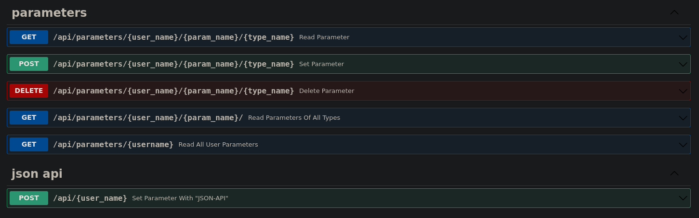
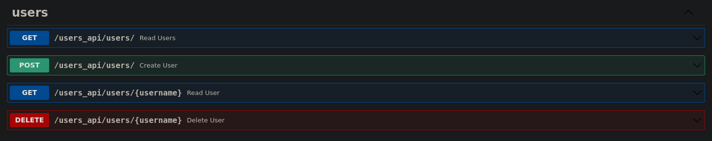

# Argstore (stands for args store)

[](https://github.com/fleshofcat/argstore/actions/workflows/ci_cd.yaml)


This is a simple REST API for storing named strings as user parameters.
Users in this system are just entities in the database, without registration or anything else.

The initial task requirements for this project were the following API, which this service implements:



A user API for testing the project has also been implemented:

(There is no update user endpoint because there are no updatable fields in users in this version.)



The application uses SQLite because it is also a task requirement.

## Usage

To test the service you can run:

``` bash
mkdir db_folder

docker run -t -p 8000:8000 -e SQLALCHEMY_DATABASE_URL=sqlite:////app/db/argstore.db -e INIT_NOT_EXISTED_DB=True -v `readlink -f db_folder`:/app/db ghcr.io/fleshofcat/argstore:latest
```

By default `hostname 0.0.0.0` and `port 8000` will be used, so open <http://localhost:8000/> end explore the doc there.

After some calls the changes will be saved in the `db/argstore.db` file.

## Run from source

Global requirements:

1. `python 3.8` or newer.
1. Also this projects uses poetry as a package manager, so [install it.](https://python-poetry.org/docs/#installation)

### Install

``` bash
git clone git@github.com:fleshofcat/argstore.git
cd argstore
poetry install
```

### Prepare DB

1. Set env var `SQLALCHEMY_DATABASE_URL`

    ``` bash
    echo "SQLALCHEMY_DATABASE_URL=sqlite:///`pwd`/my_db.db" > .env
    ```

1. Init DB file

    You can do it with alembic:

    ``` bash
    poetry run alembic upgrade head
    ```

    Or by setting env var `INIT_NOT_EXISTED_DB=True` before the run

    ``` bash
    echo "INIT_NOT_EXISTED_DB=True" >> .env
    ```

### Run

``` bash
poetry run uvicorn argstore.app:app --host 0.0.0.0 --port 8000
```

That's it, now the application is running, you can open it: <http://localhost:8000/> and send requests.

## PS for developers

After the "Install" step install the pre-commit hooks to automate code checking.

``` bash
poetry run pre-commit install -t=pre-commit -t=pre-push
```
